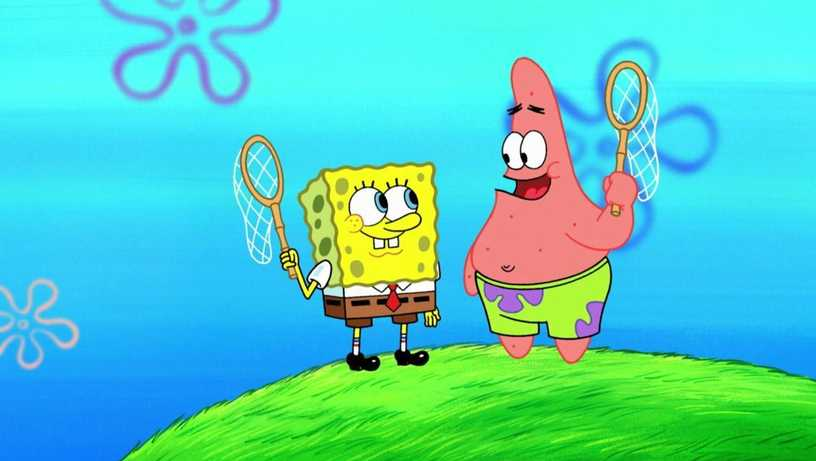
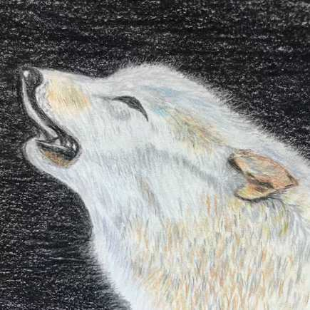
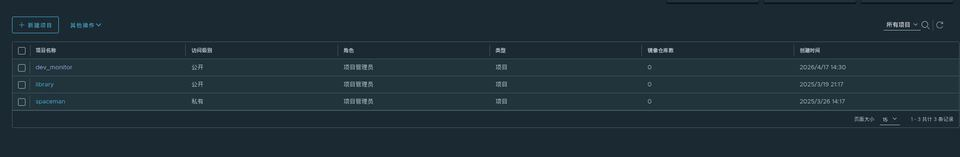
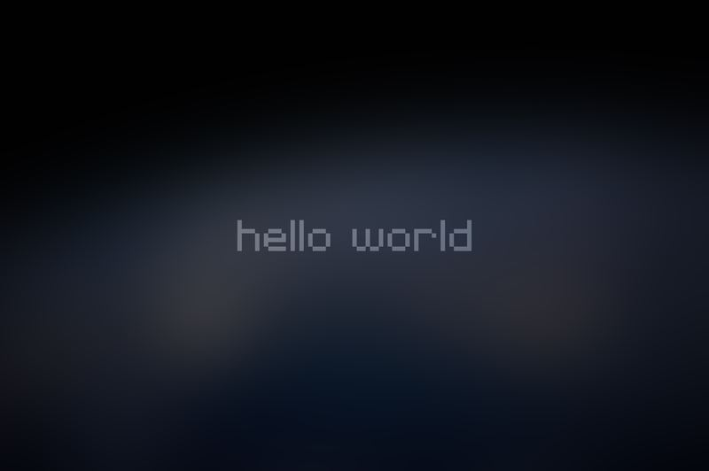
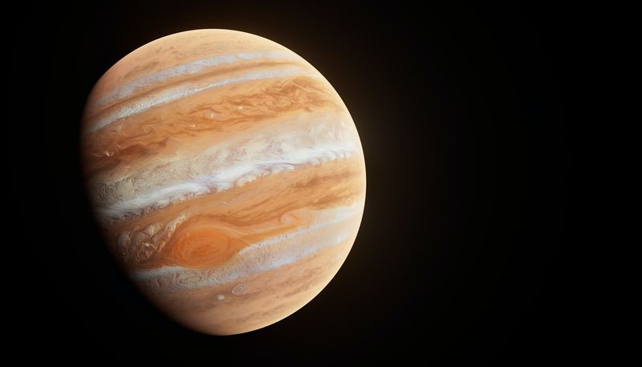
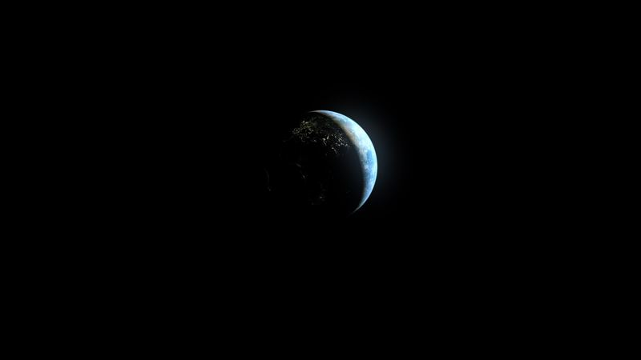
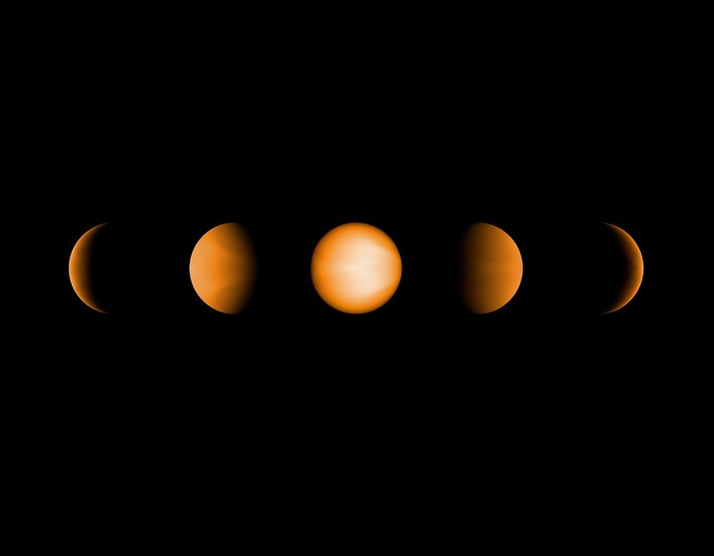

## 在 mddeck 中使用图片

用 Markdown 写幻灯片，图片是绕不开的常见元素。

本示例演示 mddeck 支持的 **5 种图片用法**：

1. `backgroundImage` 指令作全屏背景
2. 内联 `` 语法作背景
3. 内联 `` 控制尺寸
4. `backgroundPosition` / `backgroundSize` 调整
5. 多张图片拼成 2×2 网格

> 本示例用了 `perspective: 0` —— 禁用 3D 投影，幻灯片之间是 **平面平铺** 切换，
> 不再有远近 / 旋转的镜头感。想体验 3D 镜头效果看 `theme-impress.md`。

按 **空格 / 方向键** 翻页。

---

<!-- _backgroundImage: url("./media/cover-1920x1085.jpg") -->
<!-- _backgroundSize: cover -->
<!-- _color: white -->

# 封面：背景图

整张幻灯片用 `backgroundImage` 指令设了一张全屏背景图。
文本颜色通过 `color` 指令反白为 `white`，便于在深色背景上阅读。

> 提示：图片路径相对 .md 文件解析。

---



# 简写：![bg]

上面的 `` 是 Marp / Marpit 风格的简写：

- 不用写 `backgroundImage` 指令
- 默认 `backgroundSize: cover`（铺满）
- 默认 `backgroundPosition: center`
- 默认 `backgroundRepeat: no-repeat`

适合快速做"全屏图 + 标题"幻灯片。

---



# 左图右文

`` 让图片只占左边的 33%，右边留给正文：

- 头像、作者照、产品图常用此布局
- 可以跟 `width` 指令混用
- 文本部分依然由 impress.js 渲染成独立卡片

---

<!-- _backgroundImage: url("./media/cover-1920x1085.jpg") -->
<!-- _backgroundSize: 200px auto -->
<!-- _backgroundPosition: top right -->
<!-- _backgroundRepeat: repeat-x -->
<!-- _color: white -->

# 平铺背景

`backgroundRepeat: repeat-x` 让小图横向平铺到边缘。
`backgroundSize: 200px auto` 把图缩到 200px 宽。

> 与 CSS 完全一致：直接复用 `background-*` 的所有属性。

---


# cover 模式

`cover` 把图等比缩放到铺满整个画布 —— 多余部分被裁切。
1920×1080 的画布在 16:9 屏上看起来完美。

---


# contain 模式

`contain` 把图等比缩放到完整显示在画布内 —— 留出空隙。
适合让整张图都被看见，不裁切任何内容。

---


# 半透明背景

`opacity:0.15` 让背景图变成淡淡的水印。
正文依然清晰可读，但能感受到氛围。

---

# 文字 + 行内图片混排

下面这张照片，演示最普通的 Markdown 用法：



上图用 `` 控制宽度。MarPit 兼容的关键词
包括 `width` / `w`、`height` / `h`、`blur`、`brightness`、
`opacity` 等，可以并列写：``。

---

# 多图并排

四张图排成 2×2 网格：

|  |  |
| :---: | :---: |
|  |  |

> 提示：把 `![w:Npx] image` 塞进 markdown 表格的 cell 里就是 2×2 网格
> 排版，比裸的 `![w:Npx]` 段落（自动按行宽换行）稳得多。

---



# 整页是图：cover 满屏

`` + 一段简短标题 —— 最常见的全屏图 keynote 模板。

---


# 整页是图：cover 风景

换一张图，标题挪到左下角（通过加 `class: bottom-left` 等主题钩子）。

---


# 整页是图：cover 切换

`![bg]` / `![bg cover]` / `![bg contain]` 三种缩放模式展示了同一张图
在不同容器里的呈现方式。

---

## 总结：mddeck 的图片语法

- `<!-- _backgroundImage: url(...) -->` — 整张幻灯片设背景
- `` — 同上，最简写法
- `` — 图占左 N%，右边留给文字
- `` — 半透明背景（水印）
- `` — 内联图片控制尺寸
- `backgroundRepeat` / `backgroundSize` — 平铺、缩放
- `perspective: 0` — **关闭 3D 投影**，幻灯片间是平面平铺

更复杂的滤镜（`![blur:Npx]` 等）见 `theme-impress.md`。所有 Marp 兼容的
图片关键词在 mddeck 里都能用 —— 本示例强制 `perspective: 0` 来演示
纯平铺切换，想恢复 3D 镜头效果改回 `1200` 即可。

---

<!-- _backgroundColor: "#0d1117" -->
<!-- _color: white -->
<!-- _class: small -->

## 致谢

`backgroundColor: "#0d1117"` 配 `color: white` —— GitHub 风深色页作为结束页。

```bash
node packages/cli/bin/mddeck.js examples/images-demo.md \
  -o examples/images-demo.html
```

按 **Esc** 退回 overview 模式查看缩略图，**P** 打开演讲者控制台。
— mddeck 0.1.7
